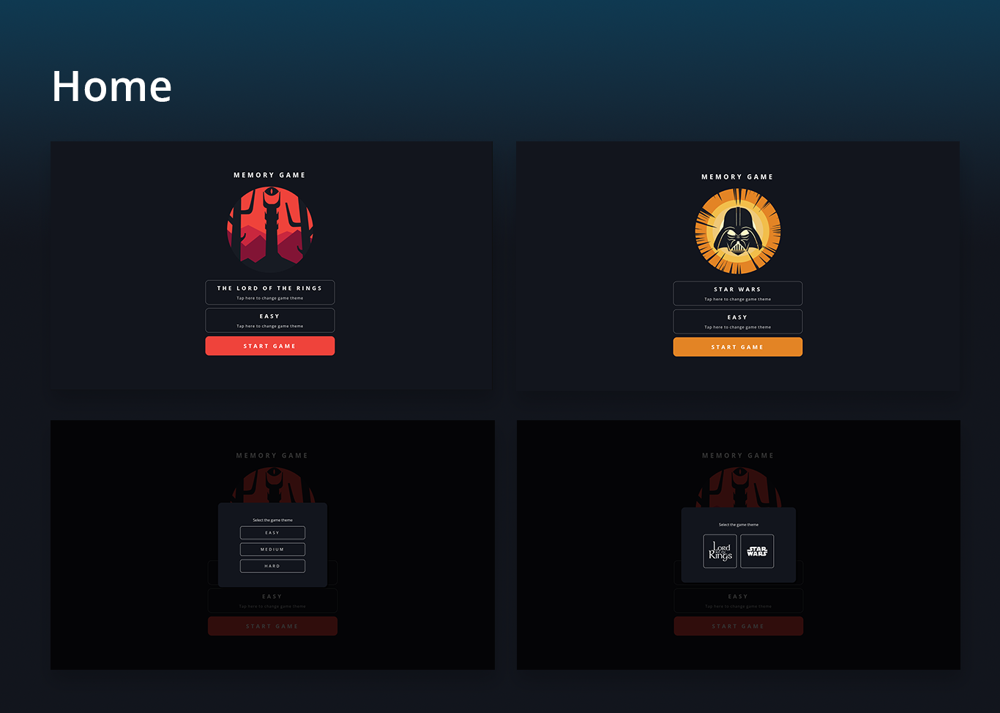
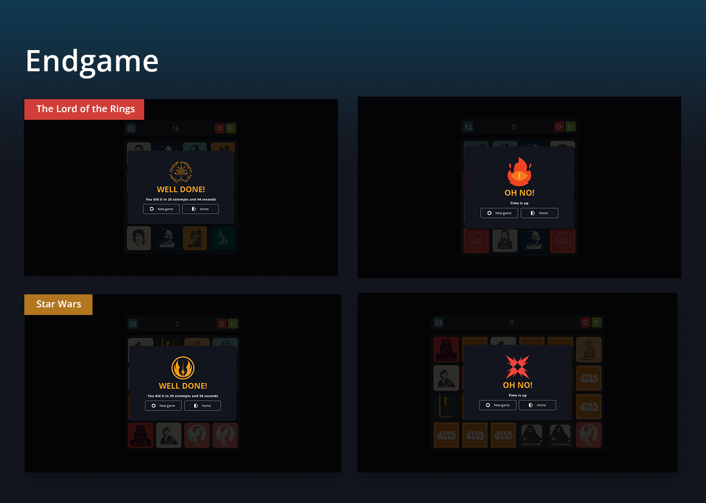
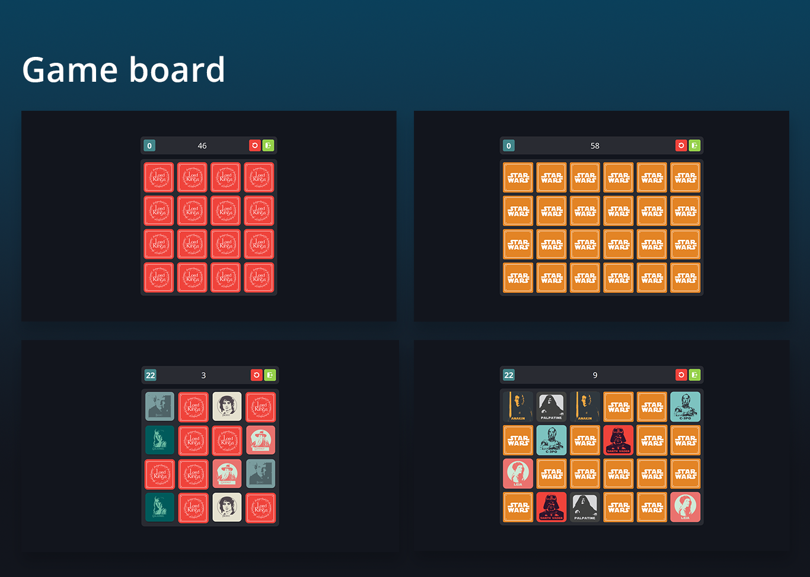

# Memory Game

This is a card game whose objective is to uncover each pair of cards in the fewest possible attempts within a one-minute time frame. The game has three difficulty levels: easy, medium, and hard, in each level the number of cards on the board increases.

## Live Demo

https://memoryama.netlify.app/

## Screenshots

## Features

- Attractive and user-friendly user interface.
- Classic memory game mechanics.
- Attempt counter to track your performance.
- Three difficulty levels: easy, medium, and hard.

## Technology used

- React
- JavaScript
- SCSS

## Install

1. Open the terminal

2. Clone this repository to the local machine:

https://github.com/santiagoTorres27/Memory-Game.git

3. Navigate to the project folder:

`cd memory-game`

4. Install the necessary dependencies:

`npm install`

5. Start the application:

`npm run dev`

The application will be available at: "http://localhost:5173/"
